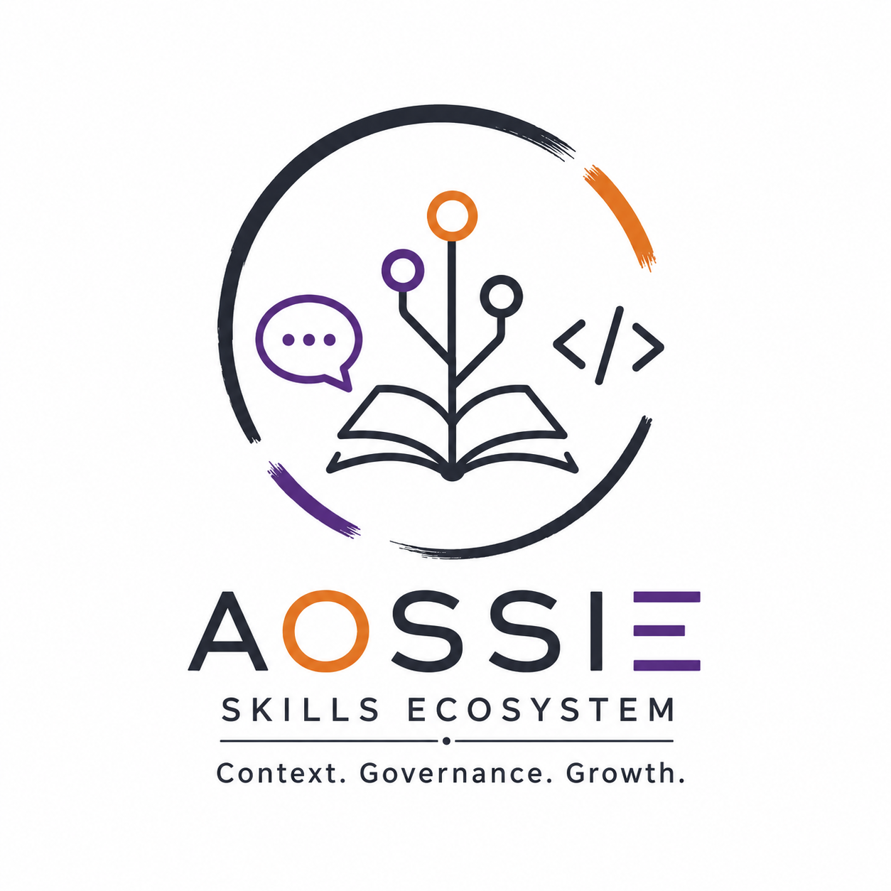
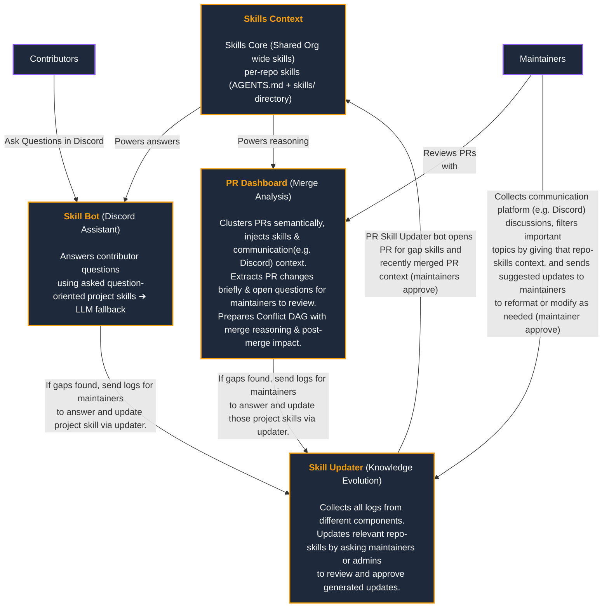

<!-- Don't delete it -->
<div name="readme-top"></div>

<!-- Organization Logo -->
<div align="center" style="display: flex; align-items: center; justify-content: center; gap: 16px;">
  
  
</div>

&nbsp;

<!-- Organization Name -->
<div align="center">

[](https://github.com/AOSSIE-Org/SkillBot)

<!-- Correct deployed url to be added -->

</div>

<!-- Organization/Project Social Handles -->
<p align="center">
<!-- Telegram -->
<a href="https://t.me/StabilityNexus">
</a>
&nbsp;&nbsp;
<!-- X (formerly Twitter) -->
<a href="https://x.com/aossie_org">
</a>
&nbsp;&nbsp;
<!-- Discord -->
<a href="https://discord.gg/hjUhu33uAn">
</a>
&nbsp;&nbsp;
<!-- LinkedIn -->
<a href="https://www.linkedin.com/company/aossie/">
  </a>
&nbsp;&nbsp;
<!-- Youtube -->
<a href="https://www.youtube.com/@AOSSIE-Org">
  </a>


[](https://scorecard.dev/viewer/?uri=github.com/AOSSIE-Org/SkillBot)

[](./BestPracticesChecklist.md)
</p>

---

<div align="center">
<h1>AOSSIE Skill Bot</h1>
<h3>Local-First Discord Assistant for Contributor Support and Repository-Aware Q&A</h3>
</div>

**Skill Bot** is a core component of the [AOSSIE Skills Ecosystem](https://github.com/AOSSIE-Org/Skills). It serves as a local-first, context-aware Discord bot designed to assist open-source contributors with onboarding, setup guidance, error debugging, and repository-specific queries. 

By analyzing user queries, dynamically detecting the target repository within the organization, loading rules from `AGENTS.md`, and executing local inference via Ollama, Skill Bot delivers precise, grounded, skills-first answers in dedicated thread environments.

---

## 🏗️ Role in the Skills Ecosystem

Skill Bot acts as the primary user-facing assistant in the skills feedback loop:



1. **Contributor Q&A**: A contributor posts a query in a designated channel or tags the bot.
2. **Context Retrieval**: Skill Bot searches the global `.clinerules`, dynamically routes queries to that repository's skills (`.agents/` + `AGENTS.md`) according to the user query, and provides this context to the local LLM to answer the user.
3. **LLM Fallback & Gap Signaling**: If matching context is found in the repository rules, the query is answered by the local LLM. If there is a lack of necessary details, the query is written to `gap_log.json` and the bot notifies the user that the query is currently out of context and maintainers will be notified. These gap signals are later consumed by maintainers in Skill Updater to update the skills context(skills core + that repo's skill).
4. **Knowledge Capture Loop**: The [Skill Updater](https://github.com/kpj2006/skill-updater) parses `gap_log.json` to prioritize and also extract discussions from Discord, automatically generating PR updates to keep the repository's skills core aligned with recent development decisions.

---

## 🚀 Key Features

* **Dynamic Repository Routing**: Dynamically discovers adjacent repositories in the workspace, detects the target project using query keywords or local LLM classification, and applies the repository's custom context (`AGENTS.md` / `.clinerules`).
* **Thread-per-Query Continuity**: Every new user interaction spawns a dedicated Discord thread. This prevents main channel pollution, keeps the conversation focused, and preserves thread-scoped history.
* **Mentor-Style Clarification**: Asks focused clarifying questions for ambiguous queries before giving a full answer, improving resolution rates and minimizing LLM noise.
* **Fully Local Inference**: Relies entirely on a local Ollama instance (such as `llama3.2` or `qwen2.5:7b`), ensuring all contributor data remains local and avoiding external cloud API costs.
* **Startup Backlog Recovery**: Scans the channel history upon startup to process any user queries that were posted while the bot was offline.
* **Structured Gap Logging**: Emits structured knowledge gap events (`gap_log.json`) recording queries that couldn't be answered using local rules, feeding into the automated updater pipeline.

---

## 💻 Tech Stack

* **Discord Bot Framework**: Discord.py (with Message Content Intent enabled)
* **Local Model Server**: Ollama
* **Programming Language**: Python 3.10+
* **HTTP Client**: httpx (async requests to Ollama API)
* **Configuration & Environment**: dotenv (dotenv-based configuration)

---

## 🔗 Repository Links

This is part of [skills ecosystem](https://github.com/AOSSIE-Org/Skills).
1. [Skills Core Repository](https://github.com/AOSSIE-Org/Skills)
2. [Interactive Simulation](https://github.com/kpj2006/InteractiveSimulation) (Live Demo: [demo](https://kpj2006.github.io/InteractiveSimulation/))
3. [Pull Request Dashboard](https://github.com/AOSSIE-Org/PullRequestDashboard)
4. [Skill Updater Pipeline](https://github.com/kpj2006/skill-updater)

---

## 🏁 Getting Started

### Prerequisites

* **Python 3.10+**
* **Ollama** installed and running on your local machine:
  * Pull the default model: `ollama pull llama3.2` (or the model configured in `.env`)
* **Discord Bot Token** with `Message Content` and `Guild Members` intents enabled.

---

### Installation & Run

#### 1. Clone the Repository

```bash
git clone https://github.com/AOSSIE-Org/SkillBot.git
cd SkillBot
```

#### 2. Set Up Virtual Environment & Dependencies

**Windows (PowerShell):**

```powershell
python -m venv venv
.\venv\Scripts\Activate.ps1
pip install -r requirements.txt
```

**macOS / Linux:**

```bash
python -m venv venv
source venv/bin/activate
pip install -r requirements.txt
```

#### 3. Configure Environment Variables

Copy the `.env.example` file to `.env`:

```bash
cp .env.example .env
```

Fill in the configuration details:

```env
DISCORD_TOKEN=your_discord_bot_token
DISCORD_CHANNEL_ID=your_target_channel_id
OLLAMA_MODEL=llama3.2
SKILL_FILE_PATH=.clinerules
```

#### 4. Launching the Bot

Start the bot using Python:

```bash
python bot.py
```

*(On Windows, you can also use `start_bot_hidden.vbs` to execute the bot silently in the background)*.

---

## 🗺️ Roadmap & Evolution

The long-term development of Skill Bot is divided into several milestones outlined in the [roadmap.md](https://github.com/AOSSIE-Org/SkillBot/blob/main/roadmap.md).

---

## 🙌 Contributing

⭐ Don't forget to star this repository if you find it useful! ⭐

Thank you for considering contributing to this project! Contributions are highly appreciated and welcomed. To ensure smooth collaboration, please refer to our [Contribution Guidelines](./CONTRIBUTING.md).

---

## ✨ Maintainers

TODO: Add maintainer information

* [Karun Pacholi](https://github.com/kpj2006) - Lead Developer & Architect
* [zahnentferner](https://github.com/Zahnentferner) - admin & reviewer

---

## 📍 License

This project is licensed under the GNU General Public License v3.0. See the [LICENSE](LICENSE) file for details.

---

## 💪 Thanks To All Contributors

Thanks a lot for spending your time helping TODO grow. Keep rocking 🥂

[](https://github.com/AOSSIE-Org/SkillBot/graphs/contributors)


© 2026 AOSSIE
